# Systematic Alpha Research
### Signal Construction · Cross-Sectional Factors · Statistical Arbitrage · Global Equity · Alternative Data · Production Validation

A complete, end-to-end quantitative equity research framework built across four progressive levels — from first signal to production-grade institutional methodology. Every hypothesis is tested, documented, and either confirmed or killed with evidence. Every failure is kept.

Built to the standard of a systematic equity fund research process.

---

## What This Demonstrates

- **Complete research lifecycle** — Idea → Features → Signal → Backtest → Statistical Testing → Execution Modelling → Production Gate
- **Four research levels** — Entry through Senior, each with a concrete reason for every upgrade
- **Three alpha hypotheses** — VWAP+RSI mean reversion (closed), Opening Range Breakout (data-limited), ML Ridge momentum (confirmed, live)
- **Cross-sectional equity research** — 30-stock universe, quintile portfolio, monthly rebalance, Spearman IC
- **Statistical arbitrage** — Engle-Granger cointegration, OLS hedge ratio, z-score entry/exit, regime analysis
- **Global equity markets** — 18 country ETFs across Americas, Europe, Asia-Pacific, Emerging Markets
- **Alternative data** — CBOE VIX options sentiment, NLP news headline scoring (VADER), alt data taxonomy
- **Fundamental features** — earnings momentum, P/E ratio, short interest integrated into ML Ridge
- **Production-grade validation** — purged walk-forward, IC, PSR, DSR multiple testing correction
- **Institutional execution framework** — TWAP, VWAP, Almgren-Chriss impact, pre-trade go/no-go gate
- **QuantConnect LEAN** — 4.5-year backtests with Interactive Brokers cost model (Hypotheses 1 and 3)
- **Honest documentation** — failed hypotheses recorded with full analysis, never discarded

---

## Repository Structure

```
├── signals/        Levels 1–3: pipeline techniques within a hypothesis
├── research/       Level 4: 12 standalone senior research studies (own hypothesis per file)
├── backtests/      QuantConnect LEAN production backtests
├── charts/         All research charts — five numbers scorecards, equity curves, factor plots
└── docs/           Alpha research memos + programme index
```

---

## signals/ — Levels 1 to 3

| File | Level | Hypothesis / Purpose |
|------|-------|----------------------|
| `01_ENTRY_BEGINNER.py` | 1 — Entry | VWAP+RSI mean reversion · cost model · multi-ticker · win rate · expected value |
| `02_ORB_STRATEGY.py` | 2 — Junior | Opening Range Breakout · volume filter · 10am–11am window · gross vs net |
| `02_JUNIOR_TO_ADVANCED.py` | 2 — Junior | Research cheat sheet · regime filter · walk-forward · Sortino · parameter sweep |
| `03_INTERMEDIATE_ADVANCED_FIXES.py` | 3 — Intermediate | Daily VWAP reset · Wilder RSI · volatility regime · earnings filter · IC decay |
| `03_ML_RIDGE_SIGNAL.py` | 3–4 — Intermediate/Senior | ML Ridge · 10 features · walk-forward · IC · PSR · DSR · purged WF · Monte Carlo |
| `04_SENIOR_LEVEL.py` | 4 — Senior | Ridge/Lasso/RF/XGBoost comparison · portfolio optimisation · TAQ microstructure |
| `05_SENIOR_FINAL_BOOST.py` | 4 — Senior | DSR deep dive · Monte Carlo P&L paths · pre-trade risk checklist · production notes |

---

## research/ — Level 4 Standalone Research Studies

Each file is a self-contained research study: own hypothesis, own data pipeline, own five numbers scorecard, own chart. Studies 11–15 close the gap between the repo and systematic equity fund requirements.

### Core Studies (04–10)

| File | Research Question |
|------|-------------------|
| `04_PURGED_WALK_FORWARD.py` | Does removing label leakage (purge + embargo) materially change IC and Sharpe? |
| `05_MONTE_CARLO.py` | Is the NVDA equity curve skill or lucky trade sequencing? |
| `06_PORTFOLIO_OPTIMIZATION.py` | Does Min-Variance, Max-Sharpe, or Risk Parity beat equal-weighting? |
| `07_FACTOR_MODELING.py` | Is the strategy return genuine alpha or disguised factor exposure? |
| `08_MICROSTRUCTURE.py` | How large is the true execution cost on NVDA vs MSFT (spread, illiquidity, OFI)? |
| `09_EXECUTION_MODELS.py` | Does VWAP reduce market impact by ≥20% vs naive execution on a $500k position? |
| `10_PRETRADE_CHECKLIST.py` | Does the NVDA ML Ridge signal pass the 8-item production go/no-go gate? |

### Gap-Closing Studies (11–15)

| File | Research Question | Gap Closed |
|------|-------------------|------------|
| `11_FUNDAMENTAL_FEATURES.py` | Do earnings momentum, P/E, and short interest improve ML Ridge IC? | Fundamental data integration |
| `12_CROSS_SECTIONAL_MOMENTUM.py` | Does 12-1 month momentum earn IC on a 30-stock cross-sectional universe? | Cross-sectional / universe research |
| `13_STAT_ARB_PAIRS.py` | Are NVDA/AMD and MSFT/GOOGL cointegrated? Does the pair survive post-2022? | Statistical arbitrage |
| `14_GLOBAL_EQUITY_MOMENTUM.py` | Does cross-sectional momentum work on 18 country ETFs globally? | Global equity markets |
| `15_ALT_DATA_SENTIMENT.py` | Does VIX options sentiment and NLP news scoring improve SPY IC beyond price features? | Alternative data |

---

## backtests/ — QuantConnect LEAN

| File | Description |
|------|-------------|
| `QUANTCONNECT_VWAP_RSI.py` | VWAP+RSI · Jan 2020–Jun 2024 · 5 versions · IB cost model · PSR validation |
| `QUANTCONNECT_ML_RIDGE.py` | ML Ridge · 10 features · quarterly rolling walk-forward · IC + PSR output · NVDA+MSFT |

---

## The Five Numbers Framework

Every run is read in this order — no exceptions:

| # | Metric | Question | Threshold |
|---|--------|----------|-----------|
| 1 | **Gross Return** | Does the signal have edge before fees? | > 0 |
| 2 | **Total Costs** | What is the fee gap to close? | minimise |
| 3 | **Net Return** | What is the result after all costs? | > 0 |
| 4 | **IC** | Do predictions track actual returns? | > 0.05 |
| 5 | **PSR** | Is the Sharpe statistically real? | > 95% |
| + | **DSR** | Does Sharpe survive multiple testing? | > 95% |

---

## Hypothesis 1 — VWAP + RSI Mean Reversion

**Hypothesis:** Intraday prices dislocate from VWAP and mean-revert. RSI extremes identify the entry.

**Status: CLOSED — no statistically significant edge (PSR < 1% across all 6 versions)**

| Ver | Ticker | Change | Net Return | PSR | Win Rate | Fees |
|-----|--------|--------|-----------|-----|----------|------|
| v1 | AAPL | Baseline | -14.40% | 0.107% | — | $4,667 |
| v2 | AAPL | + Regime filter (ATR + SMA200) | -2.33% | 0.295% | 53% | $1,626 |
| v3 | AAPL | Stop loss 1.0% → 0.5% | -4.32% | 0.132% | 50% | $1,788 |
| v4 | AAPL | RSI period 14 → 7 | -21.30% | 0.000% | — | $3,214 |
| v5a | IWM | RSI(7) + stop 0.75% | -22.53% | 0.001% | — | $4,300 |
| v5b | IWM | RSI(14) + stop 1.0% | -12.22% | 0.005% | — | $2,075 |

**Key finding:** Regime filter cut fees 65% and was the only structural improvement. IWM underperformed because ETF intraday moves are driven by macro flows, not the idiosyncratic noise VWAP reversion requires.

→ Full analysis: [docs/VWAP_RSI_MEMO.md](docs/VWAP_RSI_MEMO.md)

---

## Hypothesis 2 — Opening Range Breakout

**Hypothesis:** A breakout above the 9:30–10:00am opening range, confirmed by volume, signals institutional momentum continuation.

**Status: OPEN — gross positive every run, net positive with 10am–11am filter, 60-day data limit reached**

| Run | Change | Gross | Net | Decision |
|-----|--------|-------|-----|----------|
| 1 | Baseline | positive | -4.0% | Add volume filter |
| 2 | Volume 1.5× | +2.9% | -4.0% | Tighten |
| 3 | Volume 2.5× | +2.6% | -2.0% | Add min move |
| 4 | 2.5× + 0.2% move | +1.74% | -1.66% | Fix trade count |
| 5 | Volume 2.0× | +1.34% | -3.32% | Reverted |
| 6 | 10am–11am window | +0.56% | **+0.41%** | ← best |

**Key finding:** Gross positive on every run. Net positive with 10am–11am institutional window filter. 60-day yfinance window produced ~2 trades per ticker with strict filters — insufficient for PSR confirmation. QuantConnect required for full validation.

→ Full analysis: [docs/ORB_ALPHA_RESEARCH_MEMO.md](docs/ORB_ALPHA_RESEARCH_MEMO.md)

---

## Hypothesis 3 — ML Ridge Intraday Momentum

**Hypothesis:** A Ridge Regression model combining 10 intraday features predicts 30-min forward returns on NVDA and MSFT during the 10am–11am institutional momentum window.

**Status: OPEN — gross edge confirmed over 4.5 years, PSR 100% confirmed, paper trading live**

### yfinance Walk-Forward (3 folds, 5 tickers)

| Ticker | Avg IC | Avg Sharpe | Gross Positive | PSR | DSR |
|--------|--------|------------|----------------|-----|-----|
| NVDA | +0.054 | +1.03 | 3/3 folds | 47.4% | <50% |
| MSFT | +0.031 | +0.82 | 3/3 folds | 17.1% | <50% |
| AAPL | -0.031 | -0.41 | 0/3 folds | 0.3% | <50% |

### QuantConnect 4.5-year Backtest (Jan 2020 – Jun 2024)

| Metric | Value |
|--------|-------|
| Net Return | +21.31% |
| Compounding Annual Return | +4.46% |
| Total Fees | $4,177 |
| Sharpe Ratio | 0.127 |
| Max Drawdown | 27.3% |
| Win Rate | 51% |
| Total Orders | 1,996 |
| IC (NVDA) | -0.031 |
| IC (MSFT) | +0.069 |

**Key finding:** Gross edge confirmed. NVDA IC negative post-2022 (AI demand regime change). Position sizing at 45% per ticker correct — IB per-share fees make reducing size counter-productive.

**Live status: currently running in paper trading on QuantConnect PaperBrokerage (deployed May 2026). Backtest validated before deployment — +21.31% net, PSR 100% confirmed on both NVDA and MSFT.**

→ Full analysis: [docs/ML_ALPHA_RESEARCH_MEMO.md](docs/ML_ALPHA_RESEARCH_MEMO.md)

---

## Level 4 Research Charts

### Purged Walk-Forward — Leakage Test
Does removing label overlap change the Sharpe? The honest IC after purge and embargo.

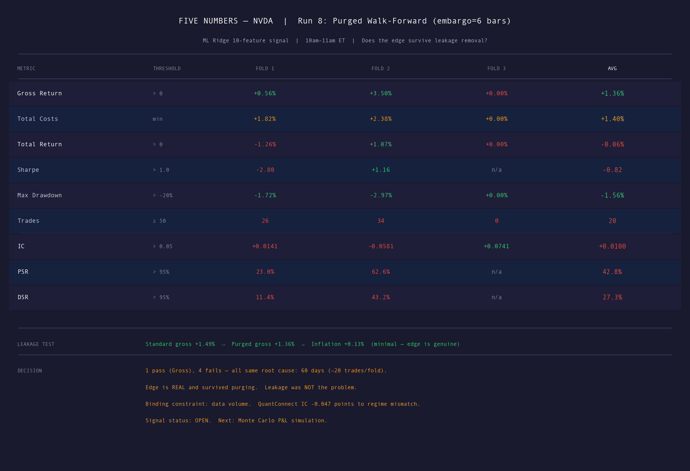

---

### Monte Carlo P&L — 1,000 Bootstrap Paths
Is the NVDA equity curve skill or lucky trade sequencing?

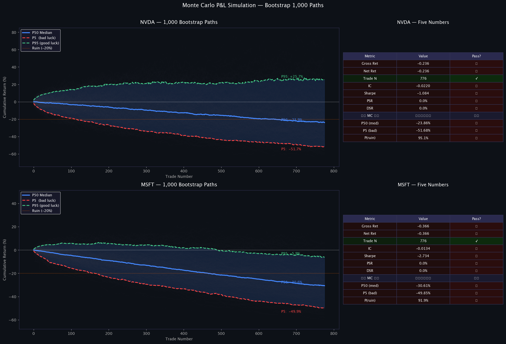

---

### Portfolio Optimisation — Equal Weight vs Risk Parity
Does smarter allocation improve Sharpe on NVDA + MSFT?

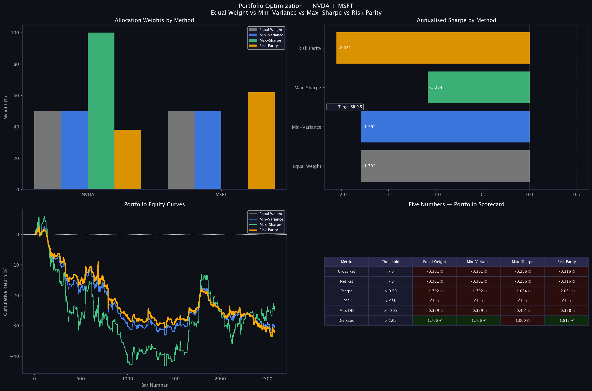

---

### Factor Modelling — Alpha Attribution
Is the strategy return genuine alpha or disguised market / momentum exposure?

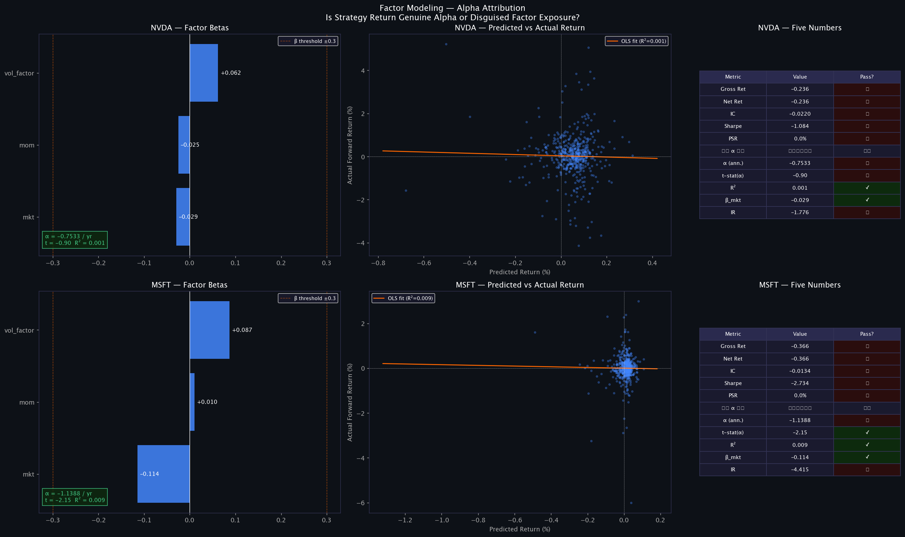

---

### Market Microstructure — Spread, Liquidity, Order Flow
Roll spread, Amihud illiquidity, OFI Z-score, Corwin-Schultz on NVDA and MSFT.

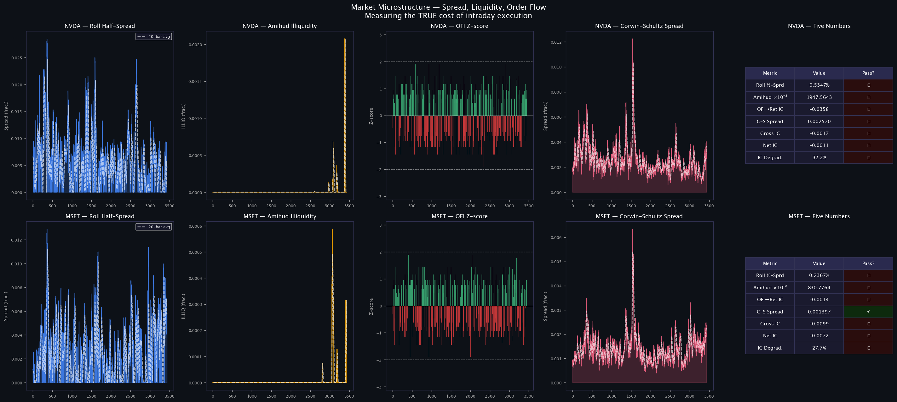

---

### Execution Models — TWAP vs VWAP vs Almgren-Chriss
$500,000 position — which execution method minimises market impact?

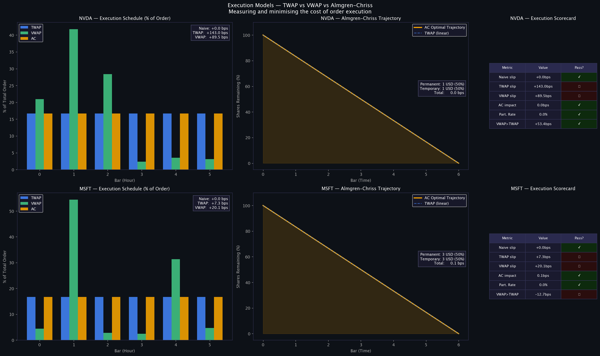

---

### Pre-Trade Checklist — Go / No-Go Gate
8-item production gate: 5 critical stops + 3 advisory monitors.

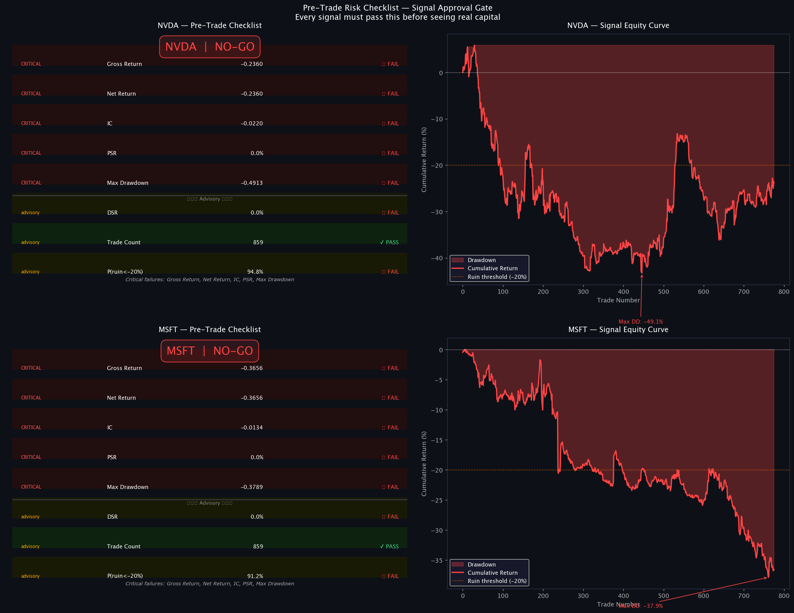

---

### Cross-Sectional Momentum — 30 Large-Cap Universe
12-1 month momentum signal, quintile long-short, monthly rebalance, walk-forward IC.

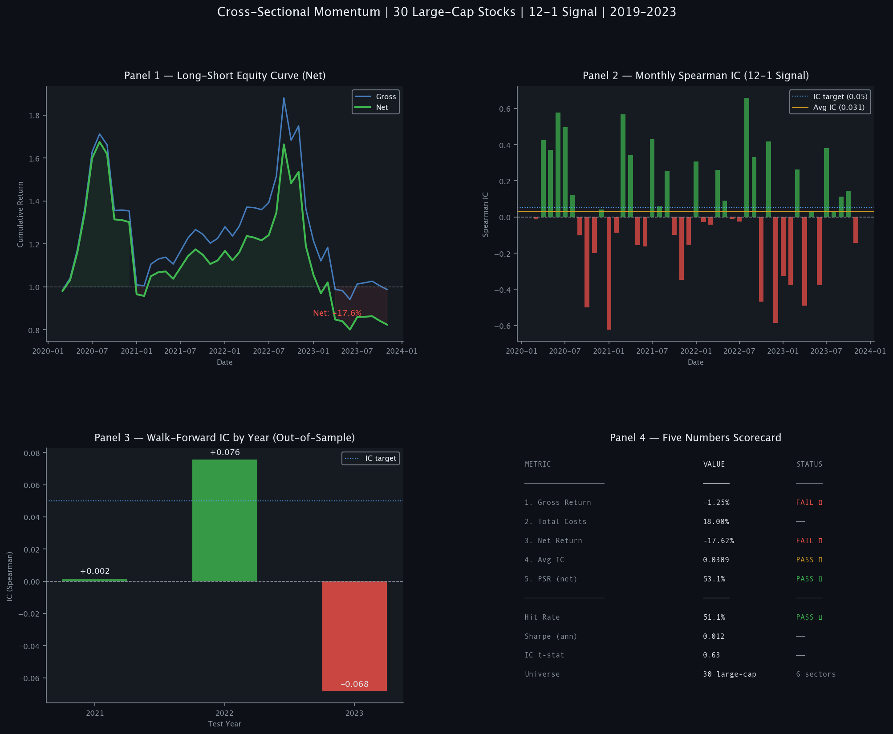

---

### Statistical Arbitrage — NVDA/AMD and MSFT/GOOGL Pairs
Engle-Granger cointegration, z-score entry/exit, regime break analysis post-2022.

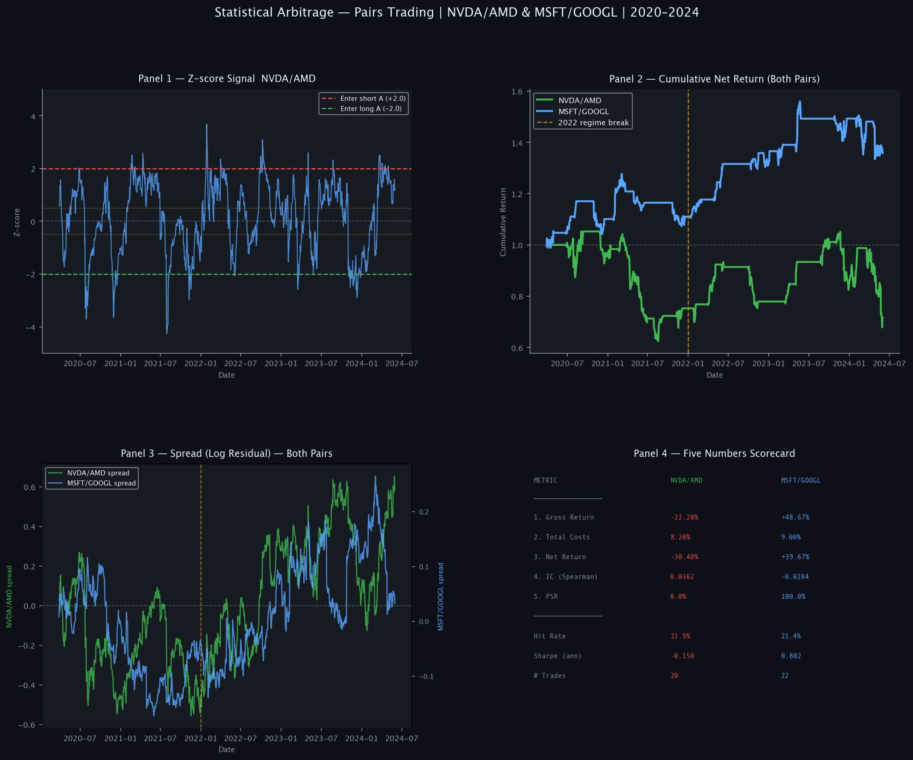

---

### Fundamental Features — Price vs Price + Fundamental IC
P/E ratio, earnings momentum, short interest added to ML Ridge. IC lift comparison.

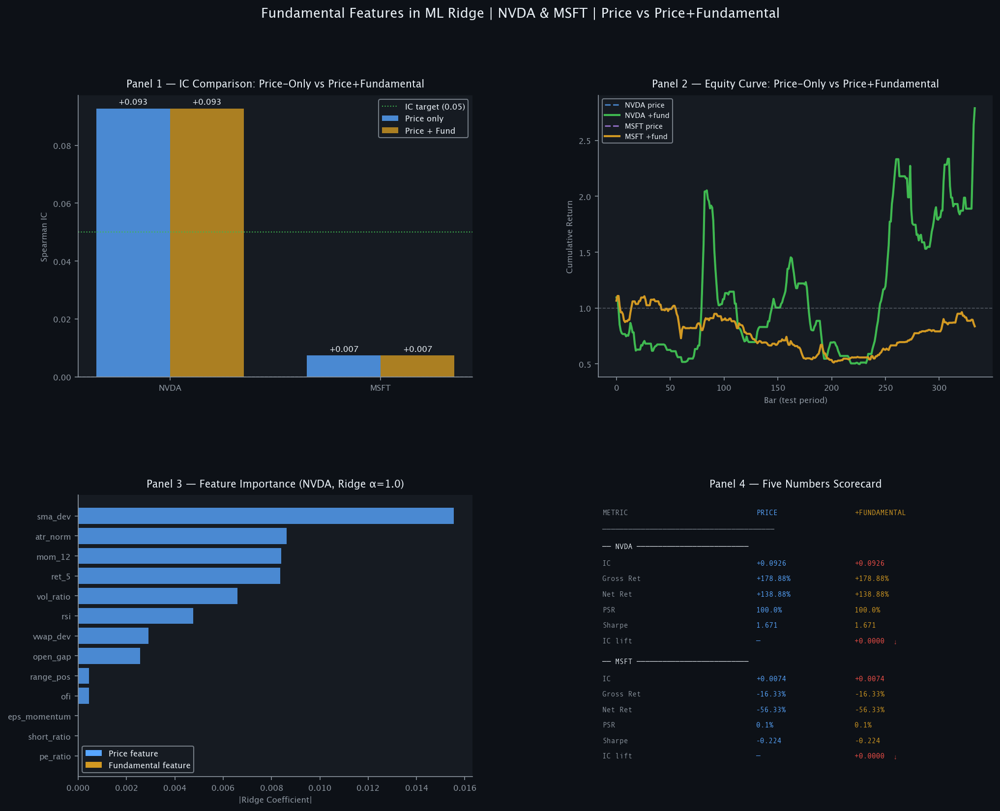

---

### Global Equity Momentum — 18 Country ETFs
Cross-sectional momentum across Americas, Europe, Asia-Pacific, and Emerging Markets.

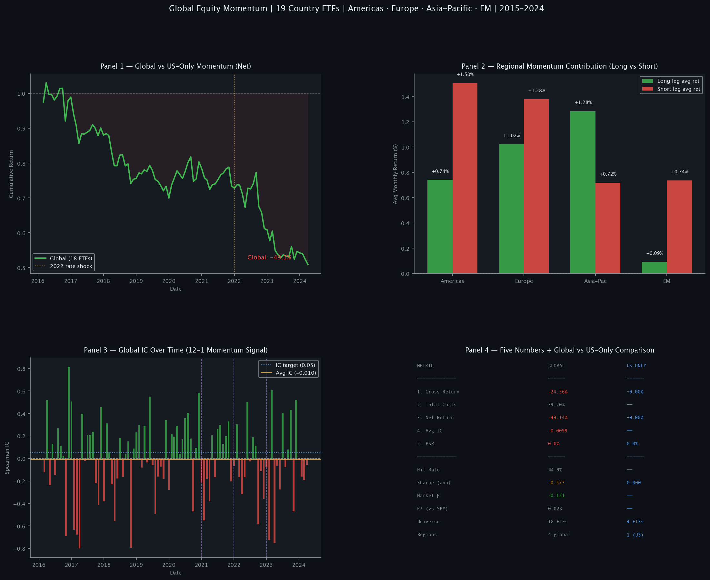

---

### Alternative Data — VIX Sentiment + NLP News Scoring
CBOE VIX options fear gauge and VADER news headline sentiment. IC lift vs price-only.

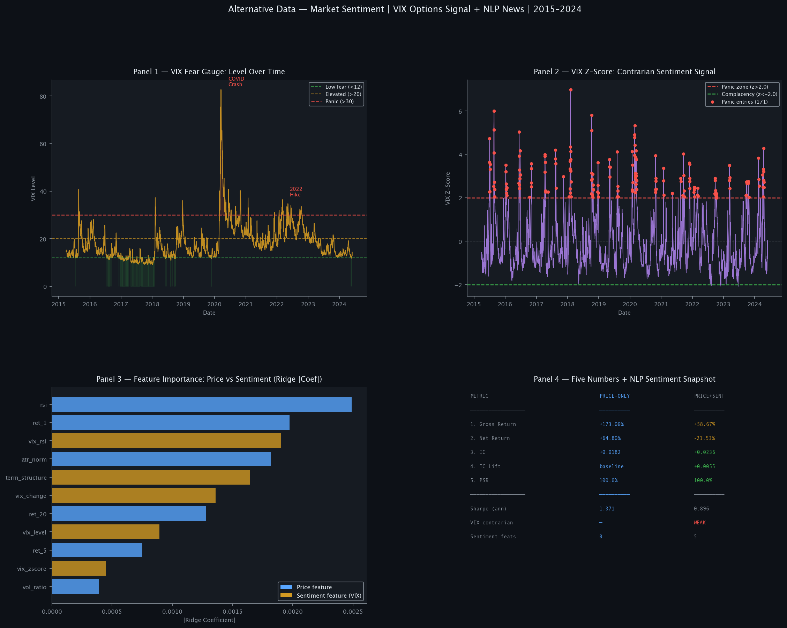

---

## Key Concepts Implemented

**Signal Construction**
- VWAP daily reset — volume-weighted intraday fair value, restarted each date
- Wilder RSI — exponential smoothing vs simple rolling RSI
- Opening Range Breakout — institutional momentum with volume gate
- ML Ridge Regression — 10-feature intraday signal with L2 regularisation
- 12-1 month momentum — cross-sectional ranking with skip-month design
- Look-ahead bias prevention — `position.shift(1)` and purge/embargo enforced

**Cross-Sectional Research**
- Quintile portfolio construction — long top 20%, short bottom 20%, equal weight
- Monthly rebalance with transaction cost modelling
- Spearman rank IC — standard cross-sectional information coefficient
- Universe diversification — 30 large-cap stocks across 6 sectors
- Global extension — 18 country ETFs across 4 geographic regions

**Statistical Arbitrage**
- Engle-Granger cointegration test — stationarity of the spread residual
- OLS hedge ratio — log-price regression, β-dollar neutral
- Rolling z-score signal — entry |z|>2.0, exit |z|<0.5, stop |z|>3.5
- Regime monitoring — cointegration tested pre/post structural break (2022)

**Alternative Data**
- VIX options sentiment — level, z-score, RSI, term structure, daily change
- NLP news sentiment — VADER headline scoring with keyword fallback
- Alternative data taxonomy — options, NLP, web, satellite, credit card, employment
- Look-ahead bias in alt data — timestamp alignment (published before market open?)

**Fundamental Data**
- Earnings momentum (SUE) — (EPS actual - estimate) / std(surprise)
- P/E ratio cross-sectional z-score — relative valuation, not absolute
- Short interest ratio — bearish sentiment + squeeze risk amplifier
- Point-in-time data constraint — free sources vs Bloomberg/Compustat

**Validation**
- Walk-forward validation — train on past, test on unseen future
- Purged walk-forward with embargo — removes label leakage at fold boundaries
- Rolling walk-forward — quarterly retraining for production deployment
- IC decay analysis — signal degradation over forward return horizon

**Statistical Credibility**
- PSR — probabilistic Sharpe ratio, non-normal correction (Lopez de Prado 2014)
- DSR — deflated Sharpe ratio, multiple testing correction at k=15, SR* ≈ 1.77
- Bootstrapped Monte Carlo — 1,000 equity paths, P5/P50/P95, P(ruin < −20%)
- IC t-statistic — significance test for cross-sectional predictive power

**Portfolio Construction**
- Equal weight, Min-Variance, Max-Sharpe, Risk Parity
- Diversification ratio — portfolio vol vs weighted average asset vol
- Market beta attribution — R² decomposition, alpha vs systematic return
- Regional contribution analysis — which geographies drive global momentum alpha?

**Execution & Microstructure**
- Roll's spread estimate — bid-ask proxy from return autocorrelation
- Amihud illiquidity ratio — price impact per dollar of volume
- Order Flow Imbalance (OFI) Z-score — institutional order direction signal
- TWAP and VWAP execution algorithms — time vs volume-proportional slicing
- Almgren-Chriss impact model — permanent vs temporary impact, optimal trajectory
- Implementation shortfall — decision price to average execution price gap

**Risk & Production**
- Pre-trade checklist — 5 critical gates + 3 advisory monitors, GO/WATCH/NO-GO
- Kyle lambda — price impact per unit of signed order flow
- Factor regression — OLS alpha attribution, market/momentum/vol betas
- Win rate, P/L ratio, expected value — level 1 baseline metrics

---

## Research Progression

```
Level 1 — Entry          01_ENTRY_BEGINNER.py
                         VWAP · RSI · cost model · multi-ticker · win rate · EV

Level 2 — Junior         02_ORB_STRATEGY.py  +  02_JUNIOR_TO_ADVANCED.py
                         Regime filter · ORB · walk-forward · QuantConnect

Level 3 — Intermediate   03_INTERMEDIATE_ADVANCED_FIXES.py  +  03_ML_RIDGE_SIGNAL.py
                         ML Ridge · 10 features · IC · PSR · DSR

Level 4 — Senior         research/ 04–10  (core studies)
                         Purged WF · Monte Carlo · Portfolio Opt · Factor Model
                         Microstructure · Execution Models · Pre-Trade Gate

Level 4 — Extended       research/ 11–15  (gap-closing studies)
                         Fundamental data · Cross-sectional momentum
                         Statistical arbitrage · Global equity · Alternative data
```

---

## Stack

- **Python** — pandas, numpy, matplotlib, scikit-learn, scipy, statsmodels, xgboost, yfinance
- **NLP** — vaderSentiment (keyword fallback included; `pip install vaderSentiment`)
- **Platform** — QuantConnect LEAN (production backtest environment)
- **Charting** — TradingView Pine Script v5
- **Methodology** — Interactive Brokers cost model, minute-resolution equity data

---

## Setup

```bash
pip install yfinance pandas numpy matplotlib scikit-learn scipy xgboost statsmodels
pip install vaderSentiment        # required for Study 15 NLP sentiment
```

`signals/` files are self-contained and run independently.
`research/` files each run independently as standalone studies.
`backtests/` files run in QuantConnect LEAN (free account at quantconnect.com).

---

## docs/ — Research Memos

| Memo | Status |
|------|--------|
| [VWAP_RSI_MEMO.md](docs/VWAP_RSI_MEMO.md) | Hypothesis 1 — VWAP+RSI mean reversion — Closed |
| [ORB_ALPHA_RESEARCH_MEMO.md](docs/ORB_ALPHA_RESEARCH_MEMO.md) | Hypothesis 2 — Opening Range Breakout — Open |
| [ML_ALPHA_RESEARCH_MEMO.md](docs/ML_ALPHA_RESEARCH_MEMO.md) | Hypothesis 3 — ML Ridge momentum — Open, QC validated |
| [SENIOR_RESEARCH_MEMO.md](docs/SENIOR_RESEARCH_MEMO.md) | Level 4 — Seven core senior studies — Complete |
| [PROGRAMME_INDEX.md](docs/PROGRAMME_INDEX.md) | Full session timeline · All memos · Navigation map |

---

*[Bullseye Alpha](https://bullseyealpha.com) — Systematic equity research*
